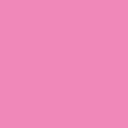

# Rx Colors

!!! note
    This document is automatically generated from the list of colors. Do not modify it.

These colors are to be used across all *Rx Open Tools*.

## Grayscale

| Color | Name | Hex |
| ---- | --------- | ------- |
| {: style="height:25px;width:25px"} | Black | #000000 |
| {: style="height:25px;width:25px"} | Obsidian | #151515 |
| {: style="height:25px;width:25px"} | Abyss Grey | #1c1c1c |
| {: style="height:25px;width:25px"} | Very Dark Grey | #222222 |
| {: style="height:25px;width:25px"} | Darker Grey | #252525 |
| {: style="height:25px;width:25px"} | Dark Grey | #333333 |
| {: style="height:25px;width:25px"} | Less Dark Grey | #434343 |
| {: style="height:25px;width:25px"} | Medium Grey | #6d6d6d |
| {: style="height:25px;width:25px"} | Less Light Grey | #9d9d9d |
| {: style="height:25px;width:25px"} | Light Grey | #e3e3e3 |
| {: style="height:25px;width:25px"} | White | #ffffff |

## Tints

Some of these tints have a specific meaning, especially when used with icons. See the [icon color](icons-colors.md) section for more information and a list of those.

### Dark tints

Darker tints are to be used on lighter backgrounds (Lightness > 50%).

| Color | Name | Hex |
| ---- | --------- | ------- |
| {: style="height:25px;width:25px"} | Dark Cyan | #00a2a3 |
| {: style="height:25px;width:25px"} | Dark Blue | #10688e |
| {: style="height:25px;width:25px"} | Dark Green | #3e8b45 |
| {: style="height:25px;width:25px"} | Dark Purple | #8109ad |
| {: style="height:25px;width:25px"} | Dark Pink | #842c53 |
| {: style="height:25px;width:25px"} | Dark Citrus | #84b330 |
| {: style="height:25px;width:25px"} | Dark Red | #ac1010 |

### Light tints

Lighter tints are to be used on darker backgrounds (Lightness < 50%).

| Color | Name | Hex |
| ---- | --------- | ------- |
| {: style="height:25px;width:25px"} | Light Cyan | #00a2a3 |
| {: style="height:25px;width:25px"} | Light Blue | #83d3f6 |
| {: style="height:25px;width:25px"} | Light Green | #8ad891 |
| {: style="height:25px;width:25px"} | Light Purple | #d588f1 |
| {: style="height:25px;width:25px"} | Light Citrus | #d8ff8c |
| {: style="height:25px;width:25px"} | Yellow | #ecd718 |
| {: style="height:25px;width:25px"} | Light Pink | #f188ba |
| {: style="height:25px;width:25px"} | Light Red | #f96969 |

## Specific colors

These colors are not part of the colors which should be used by *RxOT*, but they may be useful for intergration into host platforms.

| Color | Name | Hex |
| ---- | ------- | ----------- |
| {: style="height:25px;width:25px"} | Ae Grey | #262626 |
| {: style="height:25px;width:25px"} | Ae Blue | #2D8CEB |
| {: style="height:25px;width:25px"} | Ae Grey Light | #4d4d4d |
| {: style="height:25px;width:25px"} | Rxlab Purple | #a526c4 |
| {: style="height:25px;width:25px"} | Rainbox Productions Red | #ec1818 |