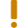

# Badges / Specific actions or states (verbs or adjectives)

!!! Note
    This list is auto-generated from existing badges, do not modify it.

A small badge may be added to the icon, showing specifically the triggered action, or changed state.

These are the proposed and most basic actions.

This list is evolutive, but the actions and states listed here must be general enough to be used and understood across different applications.
## Small Badges

These versions of the badges are made to be used with the small version of icons (between 18px and 32px).

| Icon | Action or state |
|---|---|
| {: style="height:15px;width:15px"} | Add | 
| {: style="height:15px;width:15px"} | Adjust | 
| {: style="height:15px;width:15px"} | Check | 
| {: style="height:15px;width:15px"} | Close | 
| {: style="height:15px;width:15px"} | Copy | 
| {: style="height:15px;width:15px"} | Create Save Incremental | 
| {: style="height:15px;width:15px"} | Critical | 
| {: style="height:15px;width:15px"} | Deselect | 
| {: style="height:15px;width:15px"} | Download | 
| {: style="height:15px;width:15px"} | Edit Comment Modify | 
| {: style="height:15px;width:15px"} | Export | 
| {: style="height:15px;width:15px"} | Fatal | 
| {: style="height:15px;width:15px"} | Frame Focus Center Target | 
| {: style="height:15px;width:15px"} | Go To | 
| {: style="height:15px;width:15px"} | Go | 
| {: style="height:15px;width:15px"} | Help | 
| {: style="height:15px;width:15px"} | Hide | 
| {: style="height:15px;width:15px"} | Import | 
| {: style="height:15px;width:15px"} | Load | 
| {: style="height:15px;width:15px"} | Locate | 
| {: style="height:15px;width:15px"} | Lock | 
| {: style="height:15px;width:15px"} | Move Down | 
| {: style="height:15px;width:15px"} | Move Horizontal | 
| {: style="height:15px;width:15px"} | Move Left | 
| {: style="height:15px;width:15px"} | Move Perspective Z | 
| {: style="height:15px;width:15px"} | Move Right | 
| {: style="height:15px;width:15px"} | Move Up | 
| {: style="height:15px;width:15px"} | Move Vertical | 
| {: style="height:15px;width:15px"} | Move | 
| {: style="height:15px;width:15px"} | New | 
| {: style="height:15px;width:15px"} | Ok | 
| {: style="height:15px;width:15px"} | Paste | 
| {: style="height:15px;width:15px"} | Play | 
| {: style="height:15px;width:15px"} | Protect Block | 
| {: style="height:15px;width:15px"} | Redo | 
| {: style="height:15px;width:15px"} | Reload | 
| {: style="height:15px;width:15px"} | Remove | 
| {: style="height:15px;width:15px"} | Render Compute Build | 
| {: style="height:15px;width:15px"} | Resize Horizontal | 
| {: style="height:15px;width:15px"} | Resize Vertical | 
| {: style="height:15px;width:15px"} | Resize | 
| {: style="height:15px;width:15px"} | Restore Reinit | 
| {: style="height:15px;width:15px"} | Saveas | 
| {: style="height:15px;width:15px"} | Save | 
| {: style="height:15px;width:15px"} | Search Scan | 
| {: style="height:15px;width:15px"} | Select | 
| {: style="height:15px;width:15px"} | Show | 
| {: style="height:15px;width:15px"} | Stop | 
| {: style="height:15px;width:15px"} | Undo | 
| {: style="height:15px;width:15px"} | Unlock | 
| {: style="height:15px;width:15px"} | Upload | 
| {: style="height:15px;width:15px"} | Warning | 

## Large Badges

These versions of the badges are made to be used with the large version of icons or as icons themselves.

| Icon | Action or state |
|---|---|
| {: style="height:25px;width:25px"} | Add | 
| {: style="height:25px;width:25px"} | Adjust | 
| {: style="height:25px;width:25px"} | Check | 
| {: style="height:25px;width:25px"} | Close | 
| {: style="height:25px;width:25px"} | Critical | 
| {: style="height:25px;width:25px"} | Deselect | 
| {: style="height:25px;width:25px"} | Download | 
| {: style="height:25px;width:25px"} | Edit Comment Modify | 
| {: style="height:25px;width:25px"} | Export | 
| {: style="height:25px;width:25px"} | Fatal | 
| {: style="height:25px;width:25px"} | Go To | 
| {: style="height:25px;width:25px"} | Go | 
| {: style="height:25px;width:25px"} | Help | 
| {: style="height:25px;width:25px"} | Hide | 
| {: style="height:25px;width:25px"} | Import | 
| {: style="height:25px;width:25px"} | Load | 
| {: style="height:25px;width:25px"} | Locate | 
| {: style="height:25px;width:25px"} | Lock | 
| {: style="height:25px;width:25px"} | Move Down | 
| {: style="height:25px;width:25px"} | Move Horizontal | 
| {: style="height:25px;width:25px"} | Move Left | 
| {: style="height:25px;width:25px"} | Move Right | 
| {: style="height:25px;width:25px"} | Move Up | 
| {: style="height:25px;width:25px"} | Move Vertical | 
| {: style="height:25px;width:25px"} | Move | 
| {: style="height:25px;width:25px"} | New | 
| {: style="height:25px;width:25px"} | Ok | 
| {: style="height:25px;width:25px"} | Play | 
| {: style="height:25px;width:25px"} | Protect Block | 
| {: style="height:25px;width:25px"} | Redo | 
| {: style="height:25px;width:25px"} | Reload | 
| {: style="height:25px;width:25px"} | Remove | 
| {: style="height:25px;width:25px"} | Render Compute Build | 
| {: style="height:25px;width:25px"} | Resize Horizontal | 
| {: style="height:25px;width:25px"} | Resize Vertical | 
| {: style="height:25px;width:25px"} | Resize | 
| {: style="height:25px;width:25px"} | Restore Reinit | 
| {: style="height:25px;width:25px"} | Saveas | 
| {: style="height:25px;width:25px"} | Save | 
| {: style="height:25px;width:25px"} | Search Scan | 
| {: style="height:25px;width:25px"} | Select | 
| {: style="height:25px;width:25px"} | Show | 
| {: style="height:25px;width:25px"} | Stop | 
| {: style="height:25px;width:25px"} | Undo | 
| {: style="height:25px;width:25px"} | Unlock | 
| {: style="height:25px;width:25px"} | Upload | 
| {: style="height:25px;width:25px"} | Warning | 