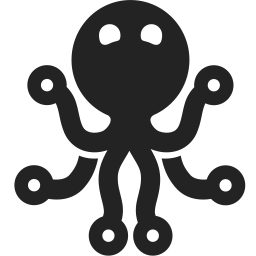

# List of icons

!!! Note
    This list is auto-generated from existing symbols, do not modify it.

## Standard

### Anatomy

| Icon | Name |
|---|---|
| {: style="height:18px;width:18px"} - {: style="height:28px;width:28px"} | Arm Bones |
| {: style="height:18px;width:18px"} - {: style="height:28px;width:28px"} | Body Bones |
| {: style="height:18px;width:18px"} - {: style="height:28px;width:28px"} | Bone |
| {: style="height:18px;width:18px"} - {: style="height:28px;width:28px"} | Ear |
| {: style="height:18px;width:18px"} - {: style="height:28px;width:28px"} | Eyebrow |
| {: style="height:18px;width:18px"} - {: style="height:28px;width:28px"} | Eye |
| {: style="height:18px;width:18px"} - {: style="height:28px;width:28px"} | Fin Bones Fishbones |
| {: style="height:18px;width:18px"} - {: style="height:28px;width:28px"} | Foot Plantigrade |
| {: style="height:18px;width:18px"} - {: style="height:28px;width:28px"} | Hair Strand |
| {: style="height:18px;width:18px"} - {: style="height:28px;width:28px"} | Hair |
| {: style="height:18px;width:18px"} - {: style="height:28px;width:28px"} | Head Skull Bones |
| {: style="height:18px;width:18px"} - {: style="height:28px;width:28px"} | Hips Pelvis Bones |
| {: style="height:18px;width:18px"} - {: style="height:28px;width:28px"} | Hoof Ungulate |
| {: style="height:18px;width:18px"} - {: style="height:28px;width:28px"} | Leg Bones |
| {: style="height:18px;width:18px"} - {: style="height:28px;width:28px"} | Mouth |
| {: style="height:18px;width:18px"} - {: style="height:28px;width:28px"} | Nose |
| {: style="height:18px;width:18px"} - {: style="height:28px;width:28px"} | Paw Digitigrade |
| {: style="height:18px;width:18px"} - {: style="height:28px;width:28px"} | Shoulders Neck Bones |
| {: style="height:18px;width:18px"} - {: style="height:28px;width:28px"} | Snake Spine Bones |
| {: style="height:18px;width:18px"} - {: style="height:28px;width:28px"} | Spine Vertebrae Bones |
| {: style="height:18px;width:18px"} - {: style="height:28px;width:28px"} | Spine Vertebrae Head Bones |
| {: style="height:18px;width:18px"} - {: style="height:28px;width:28px"} | Tail Bones |
| {: style="height:18px;width:18px"} - {: style="height:28px;width:28px"} | Tail |
| {: style="height:18px;width:18px"} - {: style="height:28px;width:28px"} | Wing Bones |

### Animals

| Icon | Name |
|---|---|
| {: style="height:18px;width:18px"} - {: style="height:28px;width:28px"} | Human |
| {: style="height:18px;width:18px"} - {: style="height:28px;width:28px"} | Snake 2 |
| {: style="height:18px;width:18px"} - {: style="height:28px;width:28px"} | Snake Cobra |
| {: style="height:18px;width:18px"} - {: style="height:28px;width:28px"} | Snake |

### Animation

| Icon | Name |
|---|---|
| {: style="height:18px;width:18px"} - {: style="height:28px;width:28px"} | 2D Camera |
| {: style="height:18px;width:18px"} - {: style="height:28px;width:28px"} | Animation |
| {: style="height:18px;width:18px"} - {: style="height:28px;width:28px"} | Change Frames Start Number |
| {: style="height:18px;width:18px"} - {: style="height:28px;width:28px"} | Frames Start Number |
| {: style="height:18px;width:18px"} - {: style="height:28px;width:28px"} | Frames |
| {: style="height:18px;width:18px"} - {: style="height:28px;width:28px"} | Interpolation |
| {: style="height:18px;width:18px"} - {: style="height:28px;width:28px"} | Keyframe |
| {: style="height:18px;width:18px"} - {: style="height:28px;width:28px"} | Onionskin |
| {: style="height:18px;width:18px"} - {: style="height:28px;width:28px"} | Stop Motion |

### Application

| Icon | Name |
|---|---|
| {: style="height:18px;width:18px"} - {: style="height:28px;width:28px"} | Assets Properties Group |
| {: style="height:18px;width:18px"} - {: style="height:28px;width:28px"} | Block Virus |
| {: style="height:18px;width:18px"} - {: style="height:28px;width:28px"} | Bug Report |
| {: style="height:18px;width:18px"} - {: style="height:28px;width:28px"} | Cache Storage Location Folder |
| {: style="height:18px;width:18px"} - {: style="height:28px;width:28px"} | Edit Calendar |
| {: style="height:18px;width:18px"} - {: style="height:28px;width:28px"} | Feature Request |
| {: style="height:18px;width:18px"} - {: style="height:28px;width:28px"} | Frame Focus Center Target Nodes |
| {: style="height:18px;width:18px"} - {: style="height:28px;width:28px"} | Go To Settings |
| {: style="height:18px;width:18px"} - {: style="height:28px;width:28px"} | Login |
| {: style="height:18px;width:18px"} - {: style="height:28px;width:28px"} | Logout |
| {: style="height:18px;width:18px"} - {: style="height:28px;width:28px"} | Maximize |
| {: style="height:18px;width:18px"} - {: style="height:28px;width:28px"} | Minimize |
| {: style="height:18px;width:18px"} - {: style="height:28px;width:28px"} | Preset Location Folder |
| {: style="height:18px;width:18px"} - {: style="height:28px;width:28px"} | Quit |
| {: style="height:18px;width:18px"} - {: style="height:28px;width:28px"} | Set Cache Storage Location Folder |
| {: style="height:18px;width:18px"} - {: style="height:28px;width:28px"} | Set Filter |
| {: style="height:18px;width:18px"} - {: style="height:28px;width:28px"} | Set Preset Location Folder |
| {: style="height:18px;width:18px"} - {: style="height:28px;width:28px"} | Set Show Grid |
| {: style="height:18px;width:18px"} - {: style="height:28px;width:28px"} | Set Show List |
| {: style="height:18px;width:18px"} - {: style="height:28px;width:28px"} | Unmaximize |
| {: style="height:18px;width:18px"} - {: style="height:28px;width:28px"} | Users |
| {: style="height:18px;width:18px"} - {: style="height:28px;width:28px"} | Warning Error |

### Brands

| Icon | Name |
|---|---|
| {: style="height:18px;width:18px"} - {: style="height:28px;width:28px"} | After Effects |
| {: style="height:18px;width:18px"} - {: style="height:28px;width:28px"} | Audition |
| {: style="height:18px;width:18px"} - {: style="height:28px;width:28px"} | Blender |
| {: style="height:18px;width:18px"} - {: style="height:28px;width:28px"} | Discord |
| {: style="height:18px;width:18px"} - {: style="height:28px;width:28px"} | Ffmpeg |
| {: style="height:18px;width:18px"} - {: style="height:28px;width:28px"} | Github |
| {: style="height:18px;width:18px"} - {: style="height:28px;width:28px"} | Illustrator |
| {: style="height:18px;width:18px"} - {: style="height:28px;width:28px"} | Krita |
| {: style="height:18px;width:18px"} - {: style="height:28px;width:28px"} | Maya |
| {: style="height:18px;width:18px"} - {: style="height:28px;width:28px"} | Nuke |
| {: style="height:18px;width:18px"} - {: style="height:28px;width:28px"} | Oca |
| {: style="height:18px;width:18px"} - {: style="height:28px;width:28px"} | Ocio |
| {: style="height:18px;width:18px"} - {: style="height:28px;width:28px"} | Patreon |
| {: style="height:18px;width:18px"} - {: style="height:28px;width:28px"} | Photoshop |
| {: style="height:18px;width:18px"} - {: style="height:28px;width:28px"} | Premiere |
| {: style="height:18px;width:18px"} - {: style="height:28px;width:28px"} | Qt |
| {: style="height:18px;width:18px"} - {: style="height:28px;width:28px"} | Ramses Daemon |
| {: style="height:18px;width:18px"} - {: style="height:28px;width:28px"} | Ramses |
| {: style="height:18px;width:18px"} - {: style="height:28px;width:28px"} | Rxlab |
| {: style="height:18px;width:18px"} - {: style="height:28px;width:28px"} | Tvpaint |

### Code

| Icon | Name |
|---|---|
| {: style="height:18px;width:18px"} - {: style="height:28px;width:28px"} | Alpha Test |
| {: style="height:18px;width:18px"} - {: style="height:28px;width:28px"} | Bash Batch Command File |
| {: style="height:18px;width:18px"} - {: style="height:28px;width:28px"} | Bash Terminal |
| {: style="height:18px;width:18px"} - {: style="height:28px;width:28px"} | Beta Test |
| {: style="height:18px;width:18px"} - {: style="height:28px;width:28px"} | Binary |
| {: style="height:18px;width:18px"} - {: style="height:28px;width:28px"} | Build Settings |
| {: style="height:18px;width:18px"} - {: style="height:28px;width:28px"} | Code File |
| {: style="height:18px;width:18px"} - {: style="height:28px;width:28px"} | Code2 |
| {: style="height:18px;width:18px"} - {: style="height:28px;width:28px"} | Code |
| {: style="height:18px;width:18px"} - {: style="height:28px;width:28px"} | Function |
| {: style="height:18px;width:18px"} - {: style="height:28px;width:28px"} | Load Code File 2 |
| {: style="height:18px;width:18px"} - {: style="height:28px;width:28px"} | Load Code File |
| {: style="height:18px;width:18px"} - {: style="height:28px;width:28px"} | Reload Code File 2 |
| {: style="height:18px;width:18px"} - {: style="height:28px;width:28px"} | Reload Code File |
| {: style="height:18px;width:18px"} - {: style="height:28px;width:28px"} | Set Bash Batch Command File |
| {: style="height:18px;width:18px"} - {: style="height:28px;width:28px"} | String |
| {: style="height:18px;width:18px"} - {: style="height:28px;width:28px"} | Use Bash Terminal |
| {: style="height:18px;width:18px"} - {: style="height:28px;width:28px"} | Versionning Git Fetch Reload |
| {: style="height:18px;width:18px"} - {: style="height:28px;width:28px"} | Versionning Git |

### Communication

| Icon | Name |
|---|---|
| {: style="height:18px;width:18px"} - {: style="height:28px;width:28px"} | Adjust Nfc Settings |
| {: style="height:18px;width:18px"} - {: style="height:28px;width:28px"} | Ad |
| {: style="height:18px;width:18px"} - {: style="height:28px;width:28px"} | Block Ad |
| {: style="height:18px;width:18px"} - {: style="height:28px;width:28px"} | Connect Chat |
| {: style="height:18px;width:18px"} - {: style="height:28px;width:28px"} | Connect Forum |
| {: style="height:18px;width:18px"} - {: style="height:28px;width:28px"} | Connect Internet |
| {: style="height:18px;width:18px"} - {: style="height:28px;width:28px"} | Connect Mail |
| {: style="height:18px;width:18px"} - {: style="height:28px;width:28px"} | Connect Social Network |
| {: style="height:18px;width:18px"} - {: style="height:28px;width:28px"} | Contacts |
| {: style="height:18px;width:18px"} - {: style="height:28px;width:28px"} | Edit Contacts |
| {: style="height:18px;width:18px"} - {: style="height:28px;width:28px"} | File Sync |
| {: style="height:18px;width:18px"} - {: style="height:28px;width:28px"} | Load Contacts |
| {: style="height:18px;width:18px"} - {: style="height:28px;width:28px"} | Nfc Chipset |
| {: style="height:18px;width:18px"} - {: style="height:28px;width:28px"} | Phone Call |
| {: style="height:18px;width:18px"} - {: style="height:28px;width:28px"} | Phone Settings |
| {: style="height:18px;width:18px"} - {: style="height:28px;width:28px"} | Play Radio Podcast |
| {: style="height:18px;width:18px"} - {: style="height:28px;width:28px"} | Remote Control |
| {: style="height:18px;width:18px"} - {: style="height:28px;width:28px"} | Send Receive Sms |
| {: style="height:18px;width:18px"} - {: style="height:28px;width:28px"} | Sms |
| {: style="height:18px;width:18px"} - {: style="height:28px;width:28px"} | Social Network |

### File

| Icon | Name |
|---|---|
| {: style="height:18px;width:18px"} - {: style="height:28px;width:28px"} | Audio File |
| {: style="height:18px;width:18px"} - {: style="height:28px;width:28px"} | Export File |
| {: style="height:18px;width:18px"} - {: style="height:28px;width:28px"} | File Arcihve |
| {: style="height:18px;width:18px"} - {: style="height:28px;width:28px"} | Files |
| {: style="height:18px;width:18px"} - {: style="height:28px;width:28px"} | Film File |
| {: style="height:18px;width:18px"} - {: style="height:28px;width:28px"} | Go To Explore Reveal Folder |
| {: style="height:18px;width:18px"} - {: style="height:28px;width:28px"} | Import File |
| {: style="height:18px;width:18px"} - {: style="height:28px;width:28px"} | List File Preset |
| {: style="height:18px;width:18px"} - {: style="height:28px;width:28px"} | Load File |
| {: style="height:18px;width:18px"} - {: style="height:28px;width:28px"} | Load List File Preset |
| {: style="height:18px;width:18px"} - {: style="height:28px;width:28px"} | Load Text File |
| {: style="height:18px;width:18px"} - {: style="height:28px;width:28px"} | Reload File |
| {: style="height:18px;width:18px"} - {: style="height:28px;width:28px"} | Render Compute Build File |
| {: style="height:18px;width:18px"} - {: style="height:28px;width:28px"} | Save List File Preset |
| {: style="height:18px;width:18px"} - {: style="height:28px;width:28px"} | Saveas List File Preset |
| {: style="height:18px;width:18px"} - {: style="height:28px;width:28px"} | Savefileas |
| {: style="height:18px;width:18px"} - {: style="height:28px;width:28px"} | Savefile |
| {: style="height:18px;width:18px"} - {: style="height:28px;width:28px"} | Set Folder |
| {: style="height:18px;width:18px"} - {: style="height:28px;width:28px"} | Set List File Preset |
| {: style="height:18px;width:18px"} - {: style="height:28px;width:28px"} | Text File |
| {: style="height:18px;width:18px"} - {: style="height:28px;width:28px"} | Video File |

### Game

| Icon | Name |
|---|---|
| {: style="height:18px;width:18px"} - {: style="height:28px;width:28px"} | Play Bus |
| {: style="height:18px;width:18px"} - {: style="height:28px;width:28px"} | Play Car |
| {: style="height:18px;width:18px"} - {: style="height:28px;width:28px"} | Play Game Cards |
| {: style="height:18px;width:18px"} - {: style="height:28px;width:28px"} | Play Language Translation |
| {: style="height:18px;width:18px"} - {: style="height:28px;width:28px"} | Play Reflection Logic |
| {: style="height:18px;width:18px"} - {: style="height:28px;width:28px"} | Play Snake 2 |
| {: style="height:18px;width:18px"} - {: style="height:28px;width:28px"} | Play Space Ship |
| {: style="height:18px;width:18px"} - {: style="height:28px;width:28px"} | Play Touch |
| {: style="height:18px;width:18px"} - {: style="height:28px;width:28px"} | Play Train |
| {: style="height:18px;width:18px"} - {: style="height:28px;width:28px"} | Play War Canon |
| {: style="height:18px;width:18px"} - {: style="height:28px;width:28px"} | Role Play |

### General

| Icon | Name |
|---|---|
| {: style="height:18px;width:18px"} - {: style="height:28px;width:28px"} | Add Property |
| {: style="height:18px;width:18px"} - {: style="height:28px;width:28px"} | Administrator |
| {: style="height:18px;width:18px"} - {: style="height:28px;width:28px"} | Alphabet |
| {: style="height:18px;width:18px"} - {: style="height:28px;width:28px"} | Application |
| {: style="height:18px;width:18px"} - {: style="height:28px;width:28px"} | Archive Box |
| {: style="height:18px;width:18px"} - {: style="height:28px;width:28px"} | Automation Sd |
| {: style="height:18px;width:18px"} - {: style="height:28px;width:28px"} | Baby Newbie Rookie Beginner |
| {: style="height:18px;width:18px"} - {: style="height:28px;width:28px"} | Bake Oven |
| {: style="height:18px;width:18px"} - {: style="height:28px;width:28px"} | Barcode |
| {: style="height:18px;width:18px"} - {: style="height:28px;width:28px"} | Barrel God |
| {: style="height:18px;width:18px"} - {: style="height:28px;width:28px"} | Batch Control |
| {: style="height:18px;width:18px"} - {: style="height:28px;width:28px"} | Bookmark_Favorite |
| {: style="height:18px;width:18px"} - {: style="height:28px;width:28px"} | Bug |
| {: style="height:18px;width:18px"} - {: style="height:28px;width:28px"} | Calculator |
| {: style="height:18px;width:18px"} - {: style="height:28px;width:28px"} | Calendar |
| {: style="height:18px;width:18px"} - {: style="height:28px;width:28px"} | Camp Campsite Tent Tipi |
| {: style="height:18px;width:18px"} - {: style="height:28px;width:28px"} | Chat |
| {: style="height:18px;width:18px"} - {: style="height:28px;width:28px"} | Check Money |
| {: style="height:18px;width:18px"} - {: style="height:28px;width:28px"} | Check News |
| {: style="height:18px;width:18px"} - {: style="height:28px;width:28px"} | Chipset |
| {: style="height:18px;width:18px"} - {: style="height:28px;width:28px"} | Clock |
| {: style="height:18px;width:18px"} - {: style="height:28px;width:28px"} | Commitment Fist |
| {: style="height:18px;width:18px"} - {: style="height:28px;width:28px"} | Connections |
| {: style="height:18px;width:18px"} - {: style="height:28px;width:28px"} | Connection |
| {: style="height:18px;width:18px"} - {: style="height:28px;width:28px"} | Constraint |
| {: style="height:18px;width:18px"} - {: style="height:28px;width:28px"} | Counter |
| {: style="height:18px;width:18px"} - {: style="height:28px;width:28px"} | Crowdfunding |
| {: style="height:18px;width:18px"} - {: style="height:28px;width:28px"} | Data Database |
| {: style="height:18px;width:18px"} - {: style="height:28px;width:28px"} | Display Screen |
| {: style="height:18px;width:18px"} - {: style="height:28px;width:28px"} | Documentation |
| {: style="height:18px;width:18px"} - {: style="height:28px;width:28px"} | Energy |
| {: style="height:18px;width:18px"} - {: style="height:28px;width:28px"} | Expert |
| {: style="height:18px;width:18px"} - {: style="height:28px;width:28px"} | Feature |
| {: style="height:18px;width:18px"} - {: style="height:28px;width:28px"} | File |
| {: style="height:18px;width:18px"} - {: style="height:28px;width:28px"} | Filter |
| {: style="height:18px;width:18px"} - {: style="height:28px;width:28px"} | Folder |
| {: style="height:18px;width:18px"} - {: style="height:28px;width:28px"} | Game Cards |
| {: style="height:18px;width:18px"} - {: style="height:28px;width:28px"} | Game |
| {: style="height:18px;width:18px"} - {: style="height:28px;width:28px"} | Grid |
| {: style="height:18px;width:18px"} - {: style="height:28px;width:28px"} | Group |
| {: style="height:18px;width:18px"} - {: style="height:28px;width:28px"} | Heart Donate |
| {: style="height:18px;width:18px"} - {: style="height:28px;width:28px"} | Help |
| {: style="height:18px;width:18px"} - {: style="height:28px;width:28px"} | Home |
| {: style="height:18px;width:18px"} - {: style="height:28px;width:28px"} | Info About |
| {: style="height:18px;width:18px"} - {: style="height:28px;width:28px"} | Internet |
| {: style="height:18px;width:18px"} - {: style="height:28px;width:28px"} | Item |
| {: style="height:18px;width:18px"} - {: style="height:28px;width:28px"} | Keyboard Control |
| {: style="height:18px;width:18px"} - {: style="height:28px;width:28px"} | Language Translation Localize |
| {: style="height:18px;width:18px"} - {: style="height:28px;width:28px"} | Language Translation |
| {: style="height:18px;width:18px"} - {: style="height:28px;width:28px"} | Leader Head Checker |
| {: style="height:18px;width:18px"} - {: style="height:28px;width:28px"} | Library Favorites |
| {: style="height:18px;width:18px"} - {: style="height:28px;width:28px"} | List |
| {: style="height:18px;width:18px"} - {: style="height:28px;width:28px"} | Mail |
| {: style="height:18px;width:18px"} - {: style="height:28px;width:28px"} | Manage Energy |
| {: style="height:18px;width:18px"} - {: style="height:28px;width:28px"} | Microchip Thread Process |
| {: style="height:18px;width:18px"} - {: style="height:28px;width:28px"} | Microchip |
| {: style="height:18px;width:18px"} - {: style="height:28px;width:28px"} | Money |
| {: style="height:18px;width:18px"} - {: style="height:28px;width:28px"} | News Newspaper |
| {: style="height:18px;width:18px"} - {: style="height:28px;width:28px"} | No Tag |
| {: style="height:18px;width:18px"} - {: style="height:28px;width:28px"} | Normal |
| {: style="height:18px;width:18px"} - {: style="height:28px;width:28px"} | Numbers Numeric |
| {: style="height:18px;width:18px"} - {: style="height:28px;width:28px"} | Phone |
| {: style="height:18px;width:18px"} - {: style="height:28px;width:28px"} | Pin Attach |
| {: style="height:18px;width:18px"} - {: style="height:28px;width:28px"} | Precision |
| {: style="height:18px;width:18px"} - {: style="height:28px;width:28px"} | Property Asset |
| {: style="height:18px;width:18px"} - {: style="height:28px;width:28px"} | Radio Transmission |
| {: style="height:18px;width:18px"} - {: style="height:28px;width:28px"} | Random Suffle |
| {: style="height:18px;width:18px"} - {: style="height:28px;width:28px"} | Range |
| {: style="height:18px;width:18px"} - {: style="height:28px;width:28px"} | Reflection Logic |
| {: style="height:18px;width:18px"} - {: style="height:28px;width:28px"} | Render Compute Build Queue |
| {: style="height:18px;width:18px"} - {: style="height:28px;width:28px"} | Ruler Measure |
| {: style="height:18px;width:18px"} - {: style="height:28px;width:28px"} | Scan Barcode |
| {: style="height:18px;width:18px"} - {: style="height:28px;width:28px"} | Select Connection |
| {: style="height:18px;width:18px"} - {: style="height:28px;width:28px"} | Set After Effects Thread Process |
| {: style="height:18px;width:18px"} - {: style="height:28px;width:28px"} | Set Microchip Thread Process |
| {: style="height:18px;width:18px"} - {: style="height:28px;width:28px"} | Set Storage Cache Data Database |
| {: style="height:18px;width:18px"} - {: style="height:28px;width:28px"} | Settings |
| {: style="height:18px;width:18px"} - {: style="height:28px;width:28px"} | Show Render Compute Build Queue |
| {: style="height:18px;width:18px"} - {: style="height:28px;width:28px"} | Sort Alphabet |
| {: style="height:18px;width:18px"} - {: style="height:28px;width:28px"} | Sort Numeric |
| {: style="height:18px;width:18px"} - {: style="height:28px;width:28px"} | Step Node |
| {: style="height:18px;width:18px"} - {: style="height:28px;width:28px"} | Storage Cache Data Database |
| {: style="height:18px;width:18px"} - {: style="height:28px;width:28px"} | Storage |
| {: style="height:18px;width:18px"} - {: style="height:28px;width:28px"} | Table |
| {: style="height:18px;width:18px"} - {: style="height:28px;width:28px"} | Tag |
| {: style="height:18px;width:18px"} - {: style="height:28px;width:28px"} | Text |
| {: style="height:18px;width:18px"} - {: style="height:28px;width:28px"} | Tools |
| {: style="height:18px;width:18px"} - {: style="height:28px;width:28px"} | Touch |
| {: style="height:18px;width:18px"} - {: style="height:28px;width:28px"} | User |
| {: style="height:18px;width:18px"} - {: style="height:28px;width:28px"} | Virus |
| {: style="height:18px;width:18px"} - {: style="height:28px;width:28px"} | War Canon |
| {: style="height:18px;width:18px"} - {: style="height:28px;width:28px"} | Weather Forecast |
| {: style="height:18px;width:18px"} - {: style="height:28px;width:28px"} | Weather |

### Geometry

| Icon | Name |
|---|---|
| {: style="height:18px;width:18px"} - {: style="height:28px;width:28px"} | Align Horizontal |
| {: style="height:18px;width:18px"} - {: style="height:28px;width:28px"} | Align Vertical |
| {: style="height:18px;width:18px"} - {: style="height:28px;width:28px"} | Angle |
| {: style="height:18px;width:18px"} - {: style="height:28px;width:28px"} | Bezier Curve |

### Image

| Icon | Name |
|---|---|
| {: style="height:18px;width:18px"} - {: style="height:28px;width:28px"} | Alpha |
| {: style="height:18px;width:18px"} - {: style="height:28px;width:28px"} | Color Palette |
| {: style="height:18px;width:18px"} - {: style="height:28px;width:28px"} | Color Settings |
| {: style="height:18px;width:18px"} - {: style="height:28px;width:28px"} | Colors |
| {: style="height:18px;width:18px"} - {: style="height:28px;width:28px"} | Copy Colors |
| {: style="height:18px;width:18px"} - {: style="height:28px;width:28px"} | Create Colors |
| {: style="height:18px;width:18px"} - {: style="height:28px;width:28px"} | Crop |
| {: style="height:18px;width:18px"} - {: style="height:28px;width:28px"} | Edit Alpha |
| {: style="height:18px;width:18px"} - {: style="height:28px;width:28px"} | Edit Image |
| {: style="height:18px;width:18px"} - {: style="height:28px;width:28px"} | Export Color Palette |
| {: style="height:18px;width:18px"} - {: style="height:28px;width:28px"} | Exposure |
| {: style="height:18px;width:18px"} - {: style="height:28px;width:28px"} | Eye Dropper |
| {: style="height:18px;width:18px"} - {: style="height:28px;width:28px"} | Frame Guide |
| {: style="height:18px;width:18px"} - {: style="height:28px;width:28px"} | Gallery |
| {: style="height:18px;width:18px"} - {: style="height:28px;width:28px"} | Image File |
| {: style="height:18px;width:18px"} - {: style="height:28px;width:28px"} | Image Sync Backup |
| {: style="height:18px;width:18px"} - {: style="height:28px;width:28px"} | Image |
| {: style="height:18px;width:18px"} - {: style="height:28px;width:28px"} | Import Color Palette |
| {: style="height:18px;width:18px"} - {: style="height:28px;width:28px"} | Layer 2D |
| {: style="height:18px;width:18px"} - {: style="height:28px;width:28px"} | Layers |
| {: style="height:18px;width:18px"} - {: style="height:28px;width:28px"} | Lut 3D Look |
| {: style="height:18px;width:18px"} - {: style="height:28px;width:28px"} | Ocio Lut 3D Look |
| {: style="height:18px;width:18px"} - {: style="height:28px;width:28px"} | Pixel Bit Depth |
| {: style="height:18px;width:18px"} - {: style="height:28px;width:28px"} | Pixel Format |
| {: style="height:18px;width:18px"} - {: style="height:28px;width:28px"} | Pixels |
| {: style="height:18px;width:18px"} - {: style="height:28px;width:28px"} | Point Light Sun |
| {: style="height:18px;width:18px"} - {: style="height:28px;width:28px"} | Raw Image File Settings |
| {: style="height:18px;width:18px"} - {: style="height:28px;width:28px"} | Raw Image File |
| {: style="height:18px;width:18px"} - {: style="height:28px;width:28px"} | Scale Z Link |
| {: style="height:18px;width:18px"} - {: style="height:28px;width:28px"} | Set Color Settings |
| {: style="height:18px;width:18px"} - {: style="height:28px;width:28px"} | Set Lut 3D Look |
| {: style="height:18px;width:18px"} - {: style="height:28px;width:28px"} | Set Pixel Format |

### Media

| Icon | Name |
|---|---|
| {: style="height:18px;width:18px"} - {: style="height:28px;width:28px"} | After Effects Composition |
| {: style="height:18px;width:18px"} - {: style="height:28px;width:28px"} | Audio Bit Depth |
| {: style="height:18px;width:18px"} - {: style="height:28px;width:28px"} | Audio Codec |
| {: style="height:18px;width:18px"} - {: style="height:28px;width:28px"} | Audio Quality Sd |
| {: style="height:18px;width:18px"} - {: style="height:28px;width:28px"} | Audio Sampling |
| {: style="height:18px;width:18px"} - {: style="height:28px;width:28px"} | Audio Video |
| {: style="height:18px;width:18px"} - {: style="height:28px;width:28px"} | Audio |
| {: style="height:18px;width:18px"} - {: style="height:28px;width:28px"} | Change Video Framerate |
| {: style="height:18px;width:18px"} - {: style="height:28px;width:28px"} | Cinema Movie |
| {: style="height:18px;width:18px"} - {: style="height:28px;width:28px"} | Cube 3D |
| {: style="height:18px;width:18px"} - {: style="height:28px;width:28px"} | Encode |
| {: style="height:18px;width:18px"} - {: style="height:28px;width:28px"} | Film |
| {: style="height:18px;width:18px"} - {: style="height:28px;width:28px"} | Interlace |
| {: style="height:18px;width:18px"} - {: style="height:28px;width:28px"} | Loop |
| {: style="height:18px;width:18px"} - {: style="height:28px;width:28px"} | Modify Fields Interlace |
| {: style="height:18px;width:18px"} - {: style="height:28px;width:28px"} | Movie Documentation |
| {: style="height:18px;width:18px"} - {: style="height:28px;width:28px"} | Music |
| {: style="height:18px;width:18px"} - {: style="height:28px;width:28px"} | Online Movie Documentation |
| {: style="height:18px;width:18px"} - {: style="height:28px;width:28px"} | Photo Camera |
| {: style="height:18px;width:18px"} - {: style="height:28px;width:28px"} | Play Music |
| {: style="height:18px;width:18px"} - {: style="height:28px;width:28px"} | Playhead Time |
| {: style="height:18px;width:18px"} - {: style="height:28px;width:28px"} | Post Production |
| {: style="height:18px;width:18px"} - {: style="height:28px;width:28px"} | Pre Production |
| {: style="height:18px;width:18px"} - {: style="height:28px;width:28px"} | Project Leader Head Admin |
| {: style="height:18px;width:18px"} - {: style="height:28px;width:28px"} | Resize Video |
| {: style="height:18px;width:18px"} - {: style="height:28px;width:28px"} | Set After Effects Composition |
| {: style="height:18px;width:18px"} - {: style="height:28px;width:28px"} | Set Audio Quality |
| {: style="height:18px;width:18px"} - {: style="height:28px;width:28px"} | Set Codec Settings |
| {: style="height:18px;width:18px"} - {: style="height:28px;width:28px"} | Set Loops |
| {: style="height:18px;width:18px"} - {: style="height:28px;width:28px"} | Set Video Framerate |
| {: style="height:18px;width:18px"} - {: style="height:28px;width:28px"} | Set Video Range |
| {: style="height:18px;width:18px"} - {: style="height:28px;width:28px"} | Set Video Speed Time Remap |
| {: style="height:18px;width:18px"} - {: style="height:28px;width:28px"} | Shot Frame |
| {: style="height:18px;width:18px"} - {: style="height:28px;width:28px"} | Shots Frames |
| {: style="height:18px;width:18px"} - {: style="height:28px;width:28px"} | Time Range Timeline |
| {: style="height:18px;width:18px"} - {: style="height:28px;width:28px"} | Tutorial |
| {: style="height:18px;width:18px"} - {: style="height:28px;width:28px"} | Video Camera |
| {: style="height:18px;width:18px"} - {: style="height:28px;width:28px"} | Video Codec |
| {: style="height:18px;width:18px"} - {: style="height:28px;width:28px"} | Video Framerate |
| {: style="height:18px;width:18px"} - {: style="height:28px;width:28px"} | Video Non Linear Editor |
| {: style="height:18px;width:18px"} - {: style="height:28px;width:28px"} | Video Quality |
| {: style="height:18px;width:18px"} - {: style="height:28px;width:28px"} | Video Range |
| {: style="height:18px;width:18px"} - {: style="height:28px;width:28px"} | Video Speed |

### Rigging Animation

| Icon | Name |
|---|---|
| {: style="height:18px;width:18px"} - {: style="height:28px;width:28px"} | Auto Rig |
| {: style="height:18px;width:18px"} - {: style="height:28px;width:28px"} | Bezier Ik |
| {: style="height:18px;width:18px"} - {: style="height:28px;width:28px"} | Bone Structure Element |
| {: style="height:18px;width:18px"} - {: style="height:28px;width:28px"} | Bone Structure Limb |
| {: style="height:18px;width:18px"} - {: style="height:28px;width:28px"} | Camera Rig |
| {: style="height:18px;width:18px"} - {: style="height:28px;width:28px"} | Constraint |
| {: style="height:18px;width:18px"} - {: style="height:28px;width:28px"} | Fk Forward Kinematics |
| {: style="height:18px;width:18px"} - {: style="height:28px;width:28px"} | Ik Fk |
| {: style="height:18px;width:18px"} - {: style="height:28px;width:28px"} | Ik Inverse Kinematics |
| {: style="height:18px;width:18px"} - {: style="height:28px;width:28px"} | Quadruped Armature Structure Bones |
| {: style="height:18px;width:18px"} - {: style="height:28px;width:28px"} | Rig Biped Armature Structure Bones |

### Transport

| Icon | Name |
|---|---|
| {: style="height:18px;width:18px"} - {: style="height:28px;width:28px"} | Bus |
| {: style="height:18px;width:18px"} - {: style="height:28px;width:28px"} | Car |
| {: style="height:18px;width:18px"} - {: style="height:28px;width:28px"} | Directions |
| {: style="height:18px;width:18px"} - {: style="height:28px;width:28px"} | Guide |
| {: style="height:18px;width:18px"} - {: style="height:28px;width:28px"} | Localize Gps |
| {: style="height:18px;width:18px"} - {: style="height:28px;width:28px"} | Map |
| {: style="height:18px;width:18px"} - {: style="height:28px;width:28px"} | Measure Speed |
| {: style="height:18px;width:18px"} - {: style="height:28px;width:28px"} | Plane |
| {: style="height:18px;width:18px"} - {: style="height:28px;width:28px"} | Running Speed |
| {: style="height:18px;width:18px"} - {: style="height:28px;width:28px"} | Running |
| {: style="height:18px;width:18px"} - {: style="height:28px;width:28px"} | Show Map |
| {: style="height:18px;width:18px"} - {: style="height:28px;width:28px"} | Space Ship |
| {: style="height:18px;width:18px"} - {: style="height:28px;width:28px"} | Speed |
| {: style="height:18px;width:18px"} - {: style="height:28px;width:28px"} | Subway |
| {: style="height:18px;width:18px"} - {: style="height:28px;width:28px"} | Train |
| {: style="height:18px;width:18px"} - {: style="height:28px;width:28px"} | Walking |

## Large

### Anatomy

| Icon | Name |
|---|---|

### Animals

| Icon | Name |
|---|---|

### Animation

| Icon | Name |
|---|---|
| {: style="height:32px;width:32px"} - {: style="height:48px;width:48px"} | Change Frames Start Number |
| {: style="height:32px;width:32px"} - {: style="height:48px;width:48px"} | Frames |

### Application

| Icon | Name |
|---|---|
| {: style="height:32px;width:32px"} - {: style="height:48px;width:48px"} | Bug Report |
| {: style="height:32px;width:32px"} - {: style="height:48px;width:48px"} | Edit Connections Pipeline |
| {: style="height:32px;width:32px"} - {: style="height:48px;width:48px"} | Go To Settings |
| {: style="height:32px;width:32px"} - {: style="height:48px;width:48px"} | Login |
| {: style="height:32px;width:32px"} - {: style="height:48px;width:48px"} | Logout |
| {: style="height:32px;width:32px"} - {: style="height:48px;width:48px"} | Maximize |
| {: style="height:32px;width:32px"} - {: style="height:48px;width:48px"} | Minimize |
| {: style="height:32px;width:32px"} - {: style="height:48px;width:48px"} | Quit |
| {: style="height:32px;width:32px"} - {: style="height:48px;width:48px"} | Unmaximize |
| {: style="height:32px;width:32px"} - {: style="height:48px;width:48px"} | Users |

### Brands

| Icon | Name |
|---|---|

### Code

| Icon | Name |
|---|---|
| {: style="height:32px;width:32px"} - {: style="height:48px;width:48px"} | Binary |
| {: style="height:32px;width:32px"} - {: style="height:48px;width:48px"} | Build Settings |
| {: style="height:32px;width:32px"} - {: style="height:48px;width:48px"} | Load Code File 2 |
| {: style="height:32px;width:32px"} - {: style="height:48px;width:48px"} | Load Code File |
| {: style="height:32px;width:32px"} - {: style="height:48px;width:48px"} | Reload Code File 2 |
| {: style="height:32px;width:32px"} - {: style="height:48px;width:48px"} | Reload Code File |
| {: style="height:32px;width:32px"} - {: style="height:48px;width:48px"} | Versionning Git Fetch Reload |

### Communication

| Icon | Name |
|---|---|
| {: style="height:32px;width:32px"} - {: style="height:48px;width:48px"} | Adjust Nfc Settings |
| {: style="height:32px;width:32px"} - {: style="height:48px;width:48px"} | File Sync |
| {: style="height:32px;width:32px"} - {: style="height:48px;width:48px"} | Load Contacts |
| {: style="height:32px;width:32px"} - {: style="height:48px;width:48px"} | Phone Call |
| {: style="height:32px;width:32px"} - {: style="height:48px;width:48px"} | Phone Settings |
| {: style="height:32px;width:32px"} - {: style="height:48px;width:48px"} | Play Radio Podcast |

### File

| Icon | Name |
|---|---|
| {: style="height:32px;width:32px"} - {: style="height:48px;width:48px"} | Export File |
| {: style="height:32px;width:32px"} - {: style="height:48px;width:48px"} | Import File |
| {: style="height:32px;width:32px"} - {: style="height:48px;width:48px"} | Load File |
| {: style="height:32px;width:32px"} - {: style="height:48px;width:48px"} | Load List File Preset |
| {: style="height:32px;width:32px"} - {: style="height:48px;width:48px"} | Load Text File |
| {: style="height:32px;width:32px"} - {: style="height:48px;width:48px"} | Reload File |
| {: style="height:32px;width:32px"} - {: style="height:48px;width:48px"} | Render Compute Build File |
| {: style="height:32px;width:32px"} - {: style="height:48px;width:48px"} | Save List File Preset |
| {: style="height:32px;width:32px"} - {: style="height:48px;width:48px"} | Saveas List File Preset |
| {: style="height:32px;width:32px"} - {: style="height:48px;width:48px"} | Savefileas |
| {: style="height:32px;width:32px"} - {: style="height:48px;width:48px"} | Savefile |

### Game

| Icon | Name |
|---|---|
| {: style="height:32px;width:32px"} - {: style="height:48px;width:48px"} | Play Bus |
| {: style="height:32px;width:32px"} - {: style="height:48px;width:48px"} | Play Car |
| {: style="height:32px;width:32px"} - {: style="height:48px;width:48px"} | Play Language Translation |
| {: style="height:32px;width:32px"} - {: style="height:48px;width:48px"} | Play Reflection Logic |
| {: style="height:32px;width:32px"} - {: style="height:48px;width:48px"} | Play Snake 2 |
| {: style="height:32px;width:32px"} - {: style="height:48px;width:48px"} | Play Space Ship |
| {: style="height:32px;width:32px"} - {: style="height:48px;width:48px"} | Play Touch |
| {: style="height:32px;width:32px"} - {: style="height:48px;width:48px"} | Play Train |
| {: style="height:32px;width:32px"} - {: style="height:48px;width:48px"} | Play War Canon |

### General

| Icon | Name |
|---|---|
| {: style="height:32px;width:32px"} - {: style="height:48px;width:48px"} | Add Property |
| {: style="height:32px;width:32px"} - {: style="height:48px;width:48px"} | Assets Property Table |
| {: style="height:32px;width:32px"} - {: style="height:48px;width:48px"} | Check Money |
| {: style="height:32px;width:32px"} - {: style="height:48px;width:48px"} | Connections Pipeline |
| {: style="height:32px;width:32px"} - {: style="height:48px;width:48px"} | Connections |
| {: style="height:32px;width:32px"} - {: style="height:48px;width:48px"} | Counter |
| {: style="height:32px;width:32px"} - {: style="height:48px;width:48px"} | Folder |
| {: style="height:32px;width:32px"} - {: style="height:48px;width:48px"} | Game Cards |
| {: style="height:32px;width:32px"} - {: style="height:48px;width:48px"} | Help |
| {: style="height:32px;width:32px"} - {: style="height:48px;width:48px"} | Leader Head Checker |
| {: style="height:32px;width:32px"} - {: style="height:48px;width:48px"} | Radio Transmission |
| {: style="height:32px;width:32px"} - {: style="height:48px;width:48px"} | Render Compute Build Queue |
| {: style="height:32px;width:32px"} - {: style="height:48px;width:48px"} | Scan Barcode |
| {: style="height:32px;width:32px"} - {: style="height:48px;width:48px"} | Select Connection |
| {: style="height:32px;width:32px"} - {: style="height:48px;width:48px"} | Settings |
| {: style="height:32px;width:32px"} - {: style="height:48px;width:48px"} | Shots Frames Table |
| {: style="height:32px;width:32px"} - {: style="height:48px;width:48px"} | Show Render Compute Build Queue |
| {: style="height:32px;width:32px"} - {: style="height:48px;width:48px"} | Sort Alphabet Reversed |
| {: style="height:32px;width:32px"} - {: style="height:48px;width:48px"} | Sort Alphabet |
| {: style="height:32px;width:32px"} - {: style="height:48px;width:48px"} | Sort Numeric Reversed |
| {: style="height:32px;width:32px"} - {: style="height:48px;width:48px"} | Sort Numeric |
| {: style="height:32px;width:32px"} - {: style="height:48px;width:48px"} | Weather Forecast |
| {: style="height:32px;width:32px"} - {: style="height:48px;width:48px"} | Weather |

### Geometry

| Icon | Name |
|---|---|

### Image

| Icon | Name |
|---|---|
| {: style="height:32px;width:32px"} - {: style="height:48px;width:48px"} | Alpha |
| {: style="height:32px;width:32px"} - {: style="height:48px;width:48px"} | Color Settings |
| {: style="height:32px;width:32px"} - {: style="height:48px;width:48px"} | Crop |
| {: style="height:32px;width:32px"} - {: style="height:48px;width:48px"} | Edit Alpha |
| {: style="height:32px;width:32px"} - {: style="height:48px;width:48px"} | Edit Image |
| {: style="height:32px;width:32px"} - {: style="height:48px;width:48px"} | Export Color Palette |
| {: style="height:32px;width:32px"} - {: style="height:48px;width:48px"} | Image Sync Backup |
| {: style="height:32px;width:32px"} - {: style="height:48px;width:48px"} | Import Color Palette |
| {: style="height:32px;width:32px"} - {: style="height:48px;width:48px"} | Layer 2D |
| {: style="height:32px;width:32px"} - {: style="height:48px;width:48px"} | Layers |
| {: style="height:32px;width:32px"} - {: style="height:48px;width:48px"} | Pixel Format |
| {: style="height:32px;width:32px"} - {: style="height:48px;width:48px"} | Set Color Settings |
| {: style="height:32px;width:32px"} - {: style="height:48px;width:48px"} | Set Pixel Format |

### Media

| Icon | Name |
|---|---|
| {: style="height:32px;width:32px"} - {: style="height:48px;width:48px"} | Audio Bit Depth |
| {: style="height:32px;width:32px"} - {: style="height:48px;width:48px"} | Audio Codec |
| {: style="height:32px;width:32px"} - {: style="height:48px;width:48px"} | Audio Sampling |
| {: style="height:32px;width:32px"} - {: style="height:48px;width:48px"} | Change Video Framerate |
| {: style="height:32px;width:32px"} - {: style="height:48px;width:48px"} | Cinema Movie Settings |
| {: style="height:32px;width:32px"} - {: style="height:48px;width:48px"} | Encode |
| {: style="height:32px;width:32px"} - {: style="height:48px;width:48px"} | Interlace |
| {: style="height:32px;width:32px"} - {: style="height:48px;width:48px"} | Play Music |
| {: style="height:32px;width:32px"} - {: style="height:48px;width:48px"} | Resize Video |
| {: style="height:32px;width:32px"} - {: style="height:48px;width:48px"} | Set Codec Settings |
| {: style="height:32px;width:32px"} - {: style="height:48px;width:48px"} | Set Video Codec |
| {: style="height:32px;width:32px"} - {: style="height:48px;width:48px"} | Set Video Framerate |
| {: style="height:32px;width:32px"} - {: style="height:48px;width:48px"} | Set Video Quality |
| {: style="height:32px;width:32px"} - {: style="height:48px;width:48px"} | Shots Frames Table |
| {: style="height:32px;width:32px"} - {: style="height:48px;width:48px"} | Video Codec |

### Rigging Animation

| Icon | Name |
|---|---|
| {: style="height:32px;width:32px"} - {: style="height:48px;width:48px"} | Auto Rig |
| {: style="height:32px;width:32px"} - {: style="height:48px;width:48px"} | Bone Structure Element |
| {: style="height:32px;width:32px"} - {: style="height:48px;width:48px"} | Bone Structure Limb |
| {: style="height:32px;width:32px"} - {: style="height:48px;width:48px"} | Fk Forward Kinematics |
| {: style="height:32px;width:32px"} - {: style="height:48px;width:48px"} | Ik Fk |
| {: style="height:32px;width:32px"} - {: style="height:48px;width:48px"} | Ik Inverse Kinematics |
| {: style="height:32px;width:32px"} - {: style="height:48px;width:48px"} | Rig Biped Armature Structure Bones |

### Transport

| Icon | Name |
|---|---|
| {: style="height:32px;width:32px"} - {: style="height:48px;width:48px"} | Localize Gps |
| {: style="height:32px;width:32px"} - {: style="height:48px;width:48px"} | Measure Speed |
| {: style="height:32px;width:32px"} - {: style="height:48px;width:48px"} | Train |