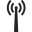
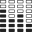

# Symbols for icons

!!! Note
    This list is auto-generated from existing symbols, do not modify it.

## Standard

### Anatomy

| Symbol | Name |
|---|---|
| {: style="height:18px;width:18px"} - {: style="height:28px;width:28px"} | Arm Bones |

### Animals

| Symbol | Name |
|---|---|
| {: style="height:18px;width:18px"} - {: style="height:28px;width:28px"} | Human |
| {: style="height:18px;width:18px"} - {: style="height:28px;width:28px"} | Snake 2 |
| {: style="height:18px;width:18px"} - {: style="height:28px;width:28px"} | Snake Cobra |
| {: style="height:18px;width:18px"} - {: style="height:28px;width:28px"} | Snake |

### Animation

| Symbol | Name |
|---|---|
| {: style="height:18px;width:18px"} - {: style="height:28px;width:28px"} | 2D Camera |
| {: style="height:18px;width:18px"} - {: style="height:28px;width:28px"} | Animation |
| {: style="height:18px;width:18px"} - {: style="height:28px;width:28px"} | Frames |
| {: style="height:18px;width:18px"} - {: style="height:28px;width:28px"} | Interpolation |
| {: style="height:18px;width:18px"} - {: style="height:28px;width:28px"} | Keyframe |
| {: style="height:18px;width:18px"} - {: style="height:28px;width:28px"} | Onionskin |
| {: style="height:18px;width:18px"} - {: style="height:28px;width:28px"} | Stop Motion |

### Brands

| Symbol | Name |
|---|---|
| {: style="height:18px;width:18px"} - {: style="height:28px;width:28px"} | After Effects |
| {: style="height:18px;width:18px"} - {: style="height:28px;width:28px"} | Audition |
| {: style="height:18px;width:18px"} - {: style="height:28px;width:28px"} | Blender |
| {: style="height:18px;width:18px"} - {: style="height:28px;width:28px"} | Ffmpeg |
| {: style="height:18px;width:18px"} - {: style="height:28px;width:28px"} | Illustrator |
| {: style="height:18px;width:18px"} - {: style="height:28px;width:28px"} | Krita |
| {: style="height:18px;width:18px"} - {: style="height:28px;width:28px"} | Oca |
| {: style="height:18px;width:18px"} - {: style="height:28px;width:28px"} | Photoshop |
| {: style="height:18px;width:18px"} - {: style="height:28px;width:28px"} | Premiere |
| {: style="height:18px;width:18px"} - {: style="height:28px;width:28px"} | Qt |
| {: style="height:18px;width:18px"} - {: style="height:28px;width:28px"} | Ramses |
| {: style="height:18px;width:18px"} - {: style="height:28px;width:28px"} | Tvpaint |

### Code

| Symbol | Name |
|---|---|
| {: style="height:18px;width:18px"} - {: style="height:28px;width:28px"} | Bash Terminal |
| {: style="height:18px;width:18px"} - {: style="height:28px;width:28px"} | Binary |
| {: style="height:18px;width:18px"} - {: style="height:28px;width:28px"} | Code2 |
| {: style="height:18px;width:18px"} - {: style="height:28px;width:28px"} | Code |
| {: style="height:18px;width:18px"} - {: style="height:28px;width:28px"} | Function |
| {: style="height:18px;width:18px"} - {: style="height:28px;width:28px"} | String |

### General

| Symbol | Name |
|---|---|
| {: style="height:18px;width:18px"} - {: style="height:28px;width:28px"} | Alphabet |
| {: style="height:18px;width:18px"} - {: style="height:28px;width:28px"} | Application |
| {: style="height:18px;width:18px"} - {: style="height:28px;width:28px"} | Archive Box |
| {: style="height:18px;width:18px"} - {: style="height:28px;width:28px"} | Baby Newbie Rookie Beginner |
| {: style="height:18px;width:18px"} - {: style="height:28px;width:28px"} | Barcode |
| {: style="height:18px;width:18px"} - {: style="height:28px;width:28px"} | Help |
| {: style="height:18px;width:18px"} - {: style="height:28px;width:28px"} | Info About |
| {: style="height:18px;width:18px"} - {: style="height:28px;width:28px"} | Internet |
| {: style="height:18px;width:18px"} - {: style="height:28px;width:28px"} | Item |
| {: style="height:18px;width:18px"} - {: style="height:28px;width:28px"} | Keyboard Control |
| {: style="height:18px;width:18px"} - {: style="height:28px;width:28px"} | Language Translation |
| {: style="height:18px;width:18px"} - {: style="height:28px;width:28px"} | Connections |
| {: style="height:18px;width:18px"} - {: style="height:28px;width:28px"} | Constraint |
| {: style="height:18px;width:18px"} - {: style="height:28px;width:28px"} | Counter |
| {: style="height:18px;width:18px"} - {: style="height:28px;width:28px"} | Documentation |
| {: style="height:18px;width:18px"} - {: style="height:28px;width:28px"} | Energy |
| {: style="height:18px;width:18px"} - {: style="height:28px;width:28px"} | Barrel God |
| {: style="height:18px;width:18px"} - {: style="height:28px;width:28px"} | Bug |
| {: style="height:18px;width:18px"} - {: style="height:28px;width:28px"} | Calculator |
| {: style="height:18px;width:18px"} - {: style="height:28px;width:28px"} | Calendar |
| {: style="height:18px;width:18px"} - {: style="height:28px;width:28px"} | Chat |
| {: style="height:18px;width:18px"} - {: style="height:28px;width:28px"} | Chipset |
| {: style="height:18px;width:18px"} - {: style="height:28px;width:28px"} | Clock |
| {: style="height:18px;width:18px"} - {: style="height:28px;width:28px"} | Expert |
| {: style="height:18px;width:18px"} - {: style="height:28px;width:28px"} | Feature |
| {: style="height:18px;width:18px"} - {: style="height:28px;width:28px"} | File |
| {: style="height:18px;width:18px"} - {: style="height:28px;width:28px"} | Folder |
| {: style="height:18px;width:18px"} - {: style="height:28px;width:28px"} | Game Cards |
| {: style="height:18px;width:18px"} - {: style="height:28px;width:28px"} | Game |
| {: style="height:18px;width:18px"} - {: style="height:28px;width:28px"} | Grid |
| {: style="height:18px;width:18px"} - {: style="height:28px;width:28px"} | Group |
| {: style="height:18px;width:18px"} - {: style="height:28px;width:28px"} | List |
| {: style="height:18px;width:18px"} - {: style="height:28px;width:28px"} | Numbers Numeric |
| {: style="height:18px;width:18px"} - {: style="height:28px;width:28px"} | Mail |
| {: style="height:18px;width:18px"} - {: style="height:28px;width:28px"} | Microchip |
| {: style="height:18px;width:18px"} - {: style="height:28px;width:28px"} | Money |
| {: style="height:18px;width:18px"} - {: style="height:28px;width:28px"} | News Newspaper |
| {: style="height:18px;width:18px"} - {: style="height:28px;width:28px"} | Normal |
| {: style="height:18px;width:18px"} - {: style="height:28px;width:28px"} | Phone |
| {: style="height:18px;width:18px"} - {: style="height:28px;width:28px"} | Precision |
| {: style="height:18px;width:18px"} - {: style="height:28px;width:28px"} | Property |
| {: style="height:18px;width:18px"} - {: style="height:28px;width:28px"} | Radio Transmission |
| {: style="height:18px;width:18px"} - {: style="height:28px;width:28px"} | Reflection Logic |
| {: style="height:18px;width:18px"} - {: style="height:28px;width:28px"} | Settings |
| {: style="height:18px;width:18px"} - {: style="height:28px;width:28px"} | Text |
| {: style="height:18px;width:18px"} - {: style="height:28px;width:28px"} | Touch |
| {: style="height:18px;width:18px"} - {: style="height:28px;width:28px"} | User |
| {: style="height:18px;width:18px"} - {: style="height:28px;width:28px"} | Virus |
| {: style="height:18px;width:18px"} - {: style="height:28px;width:28px"} | War Canon |
| {: style="height:18px;width:18px"} - {: style="height:28px;width:28px"} | Weather |

### Geometry

| Symbol | Name |
|---|---|
| {: style="height:18px;width:18px"} - {: style="height:28px;width:28px"} | Align Horizontal |
| {: style="height:18px;width:18px"} - {: style="height:28px;width:28px"} | Align Vertical |
| {: style="height:18px;width:18px"} - {: style="height:28px;width:28px"} | Angle |
| {: style="height:18px;width:18px"} - {: style="height:28px;width:28px"} | Bezier Curve |

### Image

| Symbol | Name |
|---|---|
| {: style="height:18px;width:18px"} - {: style="height:28px;width:28px"} | Alpha |
| {: style="height:18px;width:18px"} - {: style="height:28px;width:28px"} | Color |
| {: style="height:18px;width:18px"} - {: style="height:28px;width:28px"} | Crop |
| {: style="height:18px;width:18px"} - {: style="height:28px;width:28px"} | Exposure |
| {: style="height:18px;width:18px"} - {: style="height:28px;width:28px"} | Image |
| {: style="height:18px;width:18px"} - {: style="height:28px;width:28px"} | Layer 2D |
| {: style="height:18px;width:18px"} - {: style="height:28px;width:28px"} | Layers |
| {: style="height:18px;width:18px"} - {: style="height:28px;width:28px"} | Pixel Bit Depth |
| {: style="height:18px;width:18px"} - {: style="height:28px;width:28px"} | Pixels |

### Media

| Symbol | Name |
|---|---|
| {: style="height:18px;width:18px"} - {: style="height:28px;width:28px"} | Audio Bit Depth |
| {: style="height:18px;width:18px"} - {: style="height:28px;width:28px"} | Audio Sampling |
| {: style="height:18px;width:18px"} - {: style="height:28px;width:28px"} | Audio |
| {: style="height:18px;width:18px"} - {: style="height:28px;width:28px"} | Cinema Movie |
| {: style="height:18px;width:18px"} - {: style="height:28px;width:28px"} | Cube 3D |
| {: style="height:18px;width:18px"} - {: style="height:28px;width:28px"} | Film |
| {: style="height:18px;width:18px"} - {: style="height:28px;width:28px"} | Loop |
| {: style="height:18px;width:18px"} - {: style="height:28px;width:28px"} | Music |
| {: style="height:18px;width:18px"} - {: style="height:28px;width:28px"} | Photo Camera |
| {: style="height:18px;width:18px"} - {: style="height:28px;width:28px"} | Tutorial |
| {: style="height:18px;width:18px"} - {: style="height:28px;width:28px"} | Video Camera |

### Rigging Animation

| Symbol | Name |
|---|---|
| {: style="height:18px;width:18px"} - {: style="height:28px;width:28px"} | Bone Structure Element |
| {: style="height:18px;width:18px"} - {: style="height:28px;width:28px"} | Constraint |

### Transport

| Symbol | Name |
|---|---|
| {: style="height:18px;width:18px"} - {: style="height:28px;width:28px"} | Bus |
| {: style="height:18px;width:18px"} - {: style="height:28px;width:28px"} | Car |
| {: style="height:18px;width:18px"} - {: style="height:28px;width:28px"} | Directions |
| {: style="height:18px;width:18px"} - {: style="height:28px;width:28px"} | Map |
| {: style="height:18px;width:18px"} - {: style="height:28px;width:28px"} | Plane |
| {: style="height:18px;width:18px"} - {: style="height:28px;width:28px"} | Running |
| {: style="height:18px;width:18px"} - {: style="height:28px;width:28px"} | Space Ship |
| {: style="height:18px;width:18px"} - {: style="height:28px;width:28px"} | Speed |
| {: style="height:18px;width:18px"} - {: style="height:28px;width:28px"} | Subway |
| {: style="height:18px;width:18px"} - {: style="height:28px;width:28px"} | Train |
| {: style="height:18px;width:18px"} - {: style="height:28px;width:28px"} | Walking |

## Large

### Anatomy

| Symbol | Name |
|---|---|

### Animals

| Symbol | Name |
|---|---|

### Animation

| Symbol | Name |
|---|---|
| {: style="height:32px;width:32px"} - {: style="height:48px;width:48px"} | Frames |

### Brands

| Symbol | Name |
|---|---|

### Code

| Symbol | Name |
|---|---|
| {: style="height:32px;width:32px"} - {: style="height:48px;width:48px"} | Binary |

### General

| Symbol | Name |
|---|---|
| {: style="height:32px;width:32px"} - {: style="height:48px;width:48px"} | Help |
| {: style="height:32px;width:32px"} - {: style="height:48px;width:48px"} | Counter |
| {: style="height:32px;width:32px"} - {: style="height:48px;width:48px"} | Connections |
| {: style="height:32px;width:32px"} - {: style="height:48px;width:48px"} | Folder |
| {: style="height:32px;width:32px"} - {: style="height:48px;width:48px"} | Game Cards |
| {: style="height:32px;width:32px"} - {: style="height:48px;width:48px"} | Radio Transmission |
| {: style="height:32px;width:32px"} - {: style="height:48px;width:48px"} | Settings |
| {: style="height:32px;width:32px"} - {: style="height:48px;width:48px"} | Weather |

### Geometry

| Symbol | Name |
|---|---|

### Image

| Symbol | Name |
|---|---|
| {: style="height:32px;width:32px"} - {: style="height:48px;width:48px"} | Alpha |
| {: style="height:32px;width:32px"} - {: style="height:48px;width:48px"} | Crop |
| {: style="height:32px;width:32px"} - {: style="height:48px;width:48px"} | Layer 2D |
| {: style="height:32px;width:32px"} - {: style="height:48px;width:48px"} | Layers |

### Media

| Symbol | Name |
|---|---|
| {: style="height:32px;width:32px"} - {: style="height:48px;width:48px"} | Audio Bit Depth |
| {: style="height:32px;width:32px"} - {: style="height:48px;width:48px"} | Audio Sampling |

### Rigging Animation

| Symbol | Name |
|---|---|
| {: style="height:32px;width:32px"} - {: style="height:48px;width:48px"} | Bone Structure Element |

### Transport

| Symbol | Name |
|---|---|
| {: style="height:32px;width:32px"} - {: style="height:48px;width:48px"} | Measure Speed |
| {: style="height:32px;width:32px"} - {: style="height:48px;width:48px"} | Train |